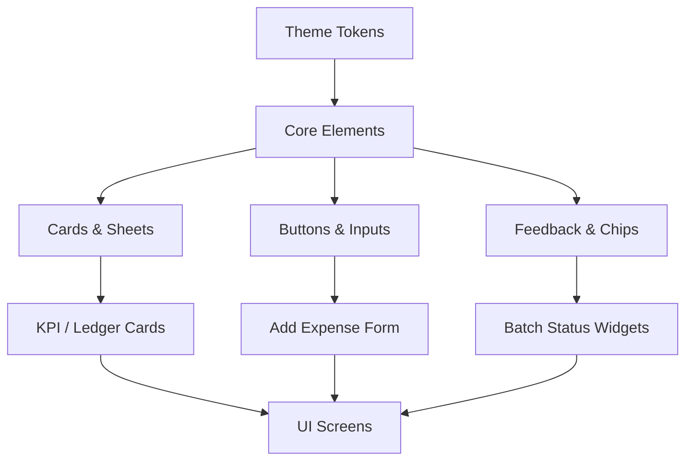

# FARMSTATS Component Library Specification

## Document Control

**Version:** 1.0.0
**Status:** Draft
**Owner:** Principal Design Systems Engineer
**Related Documents:** [DESIGN_SYSTEM.md](DESIGN_SYSTEM.md), [SCREEN_SPECIFICATION.md](../screens/SCREEN_SPECIFICATION.md)

---

> **Design Systems Note:** To ensure this document remains a highly consumable Single Source of Truth and avoids redundancy, components are grouped by family. Shared rules (Spacing, Sizing, Icon, Typography, Accessibility, M3 Compliance, Animation) are defined at the family level, followed by the explicit required properties for _every_ individual component.

---

## 1. Navigation Family

**Shared Rules:**

- **Spacing/Sizing:** 8pt grid alignment. Min touch target 48x48dp.
- **Typography:** `Label Large` for active, `Label Medium` for inactive.
- **Accessibility:** Must define `Semantics` with current state (e.g., "Tab 1 of 4, Selected").
- **M3 Compliance:** Yes (Surface tinting, pill-shaped active indicators).
- **Animation:** 250ms Emphasized Decelerate for active state pill transition.
- **Dark Mode:** Surface tint deepens; active indicator uses `PrimaryContainer`.

### 1.1 AppBar

- **Purpose/Description:** Top-level orientation and actions.
- **Use / NOT Use:** Use for primary screen titles. Do NOT use inside dialogs.
- **Variants/States:** Center Aligned, Small, Medium, Large / Scrolled, Unscrolled.
- **Properties:** Title, Leading (Back/Menu), Trailing Actions (Search, Filter).
- **Responsive:** Height expands on tablet; scrolling collapses large variant.

### 1.2 Bottom Navigation

- **Purpose/Description:** Primary mobile routing.
- **Use / NOT Use:** Use on mobile root screens. Do NOT use on Tablet.
- **Variants/States:** 3-5 destinations / Active, Inactive, Pressed.
- **Properties:** Items (Icon + Label), SelectedIndex.

### 1.3 Navigation Rail

- **Purpose/Description:** Primary tablet routing.
- **Use / NOT Use:** Use on Tablet/Landscape. Do NOT use on mobile.
- **Variants/States:** Collapsed, Expanded / Active, Inactive.
- **Properties:** Header (FAB), Destinations, Footer (Settings).

### 1.4 Top Tabs

- **Purpose/Description:** Peer-level content switching (e.g., Income vs Expense).
- **Use / NOT Use:** Use for closely related data views. Do NOT use for primary routing.
- **Variants/States:** Fixed, Scrollable / Selected, Unselected.
- **Properties:** Tab length, Indicator color, Text.

### 1.5 Segmented Control

- **Purpose/Description:** Inline binary/trinary choice (e.g., Present/Absent).
- **Use / NOT Use:** Use in forms for quick switching. Do NOT use for >4 options.
- **Variants/States:** Outlined, Tonal / Selected, Unselected.
- **Properties:** Options, SelectedIndex.

---

## 2. Button Family

**Shared Rules:**

- **Spacing/Sizing:** Height 48px, Radius `pill` (999px). Internal padding 24px horizontal.
- **Typography:** `Label Large`.
- **Accessibility:** `Role.button`, read state if disabled.
- **M3 Compliance:** Yes.
- **Animation:** 150ms ripple effect, slight scale down (0.98x) on tap.

### 2.1 Primary Button

- **Purpose/Use:** Main screen action (e.g., "Save Expense"). Only ONE per screen.
- **Properties/States:** Label, Icon (optional) / Default, Hover, Pressed, Disabled (Grey).
- **Dark Mode:** `Primary` background, `OnPrimary` text.

### 2.2 Secondary Button

- **Purpose/Use:** Alternative actions. Uses `SecondaryContainer`.
- **Properties/States:** Label / Default, Pressed, Disabled.

### 2.3 Outlined Button

- **Purpose/Use:** Medium-emphasis actions. Transparent with `Outline` border.
- **Properties/States:** Label / Default, Pressed, Disabled.

### 2.4 Text Button

- **Purpose/Use:** Low-emphasis actions (e.g., "Cancel").
- **Properties/States:** Label / Default, Pressed.

### 2.5 Icon Button

- **Purpose/Use:** Actions lacking space for text (e.g., Top Bar actions).
- **Properties/States:** IconData / Default, Pressed.

### 2.6 Floating Action Button (FAB)

- **Purpose/Use:** Prominent primary action. 56x56dp standard.
- **Properties/States:** IconData, Color / Resting (Level 3), Pressed (Level 4).

### 2.7 Extended FAB

- **Purpose/Use:** FAB with text label for clarity. Used on lists.
- **Properties/States:** IconData, Label / Expanded, Collapsed (on scroll).

---

## 3. Input Family

**Shared Rules:**

- **Spacing/Sizing:** Height 56px, Radius `8px`.
- **Typography:** `Body Large` for input, `Label Small` for floating hint.
- **Accessibility:** Must define `hintText` and error traversal for screen readers.
- **M3 Compliance:** Yes (Outlined variant used exclusively).
- **Animation:** Floating label animates up over 150ms on focus.

### 3.1 Text Field

- **Purpose/Use:** Standard alphanumeric entry.
- **Properties/States:** Controller, Hint, Label, Helper / Idle, Focused, Error, Disabled.

### 3.2 Currency Input

- **Purpose/Use:** Monetary entry.
- **Properties:** Currency Prefix (e.g., 'Rs'), Auto-formats with commas. Keyboard: `decimal`.

### 3.3 Numeric Input

- **Purpose/Use:** Quantities/Weights.
- **Properties:** Keyboard: `number`.

### 3.4 Search Bar

- **Purpose/Use:** Finding data. Pill-shaped, Level 2 elevation.
- **Properties:** Leading Icon (Search), Trailing (Clear).

### 3.5 Dropdown

- **Purpose/Use:** Selecting from predefined lists.
- **Properties:** Items, Value, Trailing Icon (Caret Down).

### 3.6 Autocomplete

- **Purpose/Use:** Selecting from large sets (e.g., Tags). Filters on type.
- **Properties:** Options builder, current query.

### 3.7 Date Picker / 3.8 Time Picker

- **Purpose/Use:** Temporal selection. Invokes native OS modals.

---

## 4. Card & Container Family

**Shared Rules:**

- **Spacing/Sizing:** 16px internal padding. Radius `12px`.
- **M3 Compliance:** Yes (Elevated, Filled, or Outlined variants).

### 4.1 Card (Base)

- **Purpose:** Base component for all specialized cards.
- **States:** Elevated (Level 1), Outlined (Level 0).

### 4.2 Dashboard Card / 4.3 KPI Card

- **Purpose:** Top-level metrics. Contains Display Typography and Sparklines.

### 4.4 Expense Card / 4.5 Income Card

- **Purpose:** Ledger rows.
- **Properties:** Amount, Category, Date, Icon (Red/Green semantics).

### 4.6 Inventory Card

- **Purpose:** Stock tracking. Contains progress bar indicating reorder level.

### 4.7 Worker Card / 4.8 Batch Card

- **Purpose:** Entity summaries. Features Avatar/Status badges.

### 4.9 Summary Card / 4.10 Analytics Card / 4.11 Report Card

- **Purpose:** Read-only data aggregation and chart bounding boxes.

### 4.12 List Tile

- **Purpose:** Standard list rows.
- **Properties:** Leading, Title, Subtitle, Trailing. Height > 72px.

### 4.13 Section Header

- **Purpose:** Grouping lists (e.g., "July 2026"). Uses `Title Medium`.

---

## 5. Information & Feedback Family

**Shared Rules:**

- **Animation:** 250ms fade-in/slide-up.

### 5.1 Status Badge

- **Purpose:** Small pill (16px) indicating state (Active, Closed).
- **Properties:** Color (Semantic), Label.

### 5.2 Tag / 5.3 Chip

- **Purpose:** Filtering or categorization. 32px height, 8px radius.
- **States:** Selected (Filled), Unselected (Outlined).

### 5.4 Avatar

- **Purpose:** User/Worker visual identifier. Circular.

### 5.5 Profile Header

- **Purpose:** Settings root visual. Contains Avatar + Name.

### 5.6 Timeline / 5.7 Stepper

- **Purpose:** Batch lifecycle tracking. Vertical line connecting nodes.

### 5.8 Progress Indicator (Circular / Linear)

- **Purpose:** Async loading state feedback. Uses `Primary` color.

### 5.9 Loading Skeleton / 5.10 Shimmer Placeholder

- **Purpose:** Pre-loading structure. Animated gray gradient.

### 5.11 Snackbar / 5.12 Alert Dialog / 5.13 Confirmation Dialog

- **Purpose:** Temporary feedback and destructive confirmations. Scrim 60%.

### 5.14 Bottom Sheet / 5.15 Modal Sheet / 5.16 Filter Sheet / 5.17 Date Range Sheet

- **Purpose:** Contextual overlays. Top radius 16px. Drag handle required.

### 5.18 Empty State / 5.19 Error State / 5.20 Offline Banner

- **Purpose:** Handing nil/failed data elegantly. Large icon + Title + Action.

### 5.21 Backup Progress / 5.22 Restore Progress

- **Purpose:** Blocking modals during DB I/O. Prevents dismissal.

### 5.23 Notification Tile / 5.24 Settings Tile / 5.25 About Tile / 5.26 Help Tile

- **Purpose:** Specialized ListTiles with specific trailing icons (Carrots, Toggles).

---

## 6. Advanced Data Family

### 6.1 Search Result Tile

- **Purpose:** Highlights matched text query within the subtitle.

### 6.2 Chart Card / 6.3 Line Chart / 6.4 Bar Chart / 6.5 Pie Chart / 6.6 Area Chart

- **Purpose:** Visual data. No internal scrolling. Uses D3/Fl_Chart abstractions. Animates up from 0 on load.

### 6.7 Data Table

- **Purpose:** Dense data. _Tablet strictly_. Scrollable horizontally.

### 6.8 Image Viewer / 6.9 PDF Viewer Placeholder / 6.10 File Attachment Tile

- **Purpose:** Asset handling.

### 6.11 Section Divider

- **Purpose:** Visual break. 1px height, `Outline` color.

### 6.12 Floating Filter / 6.13 Action Menu / 6.14 Context Menu

- **Purpose:** Absolute positioned popup menus tied to icon taps.

### 6.15 Tooltip

- **Purpose:** Accessibility labels on long-press of icon buttons.

### 6.16 Expansion Tile / 6.17 Accordion

- **Purpose:** Collapsible data (e.g., Monthly expense breakdowns).

### 6.18 Calendar Widget

- **Purpose:** Inline date selection.

---

## Architecture Diagrams

### Component Dependency Hierarchy

### Reusability Matrix (Conceptual)

| Component | Dashboard | Ledger | Batches | Settings | Reusability Score |
| --------- | --------- | ------ | ------- | -------- | ----------------- |
| FAB       | ✔️        | ✔️     | ✔️      | ❌       | High              |
| KPI Card  | ✔️        | ✔️     | ❌      | ❌       | Medium            |
| ListTile  | ❌        | ✔️     | ✔️      | ✔️       | Critical          |
| TextInput | ❌        | ✔️     | ✔️      | ✔️       | Critical          |
| Chart     | ✔️        | ✔️     | ❌      | ❌       | Low/Specialized   |
