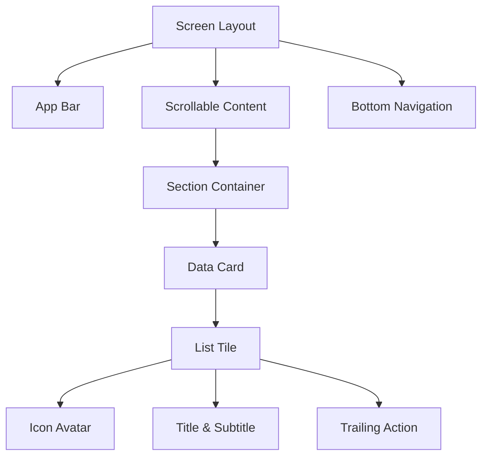
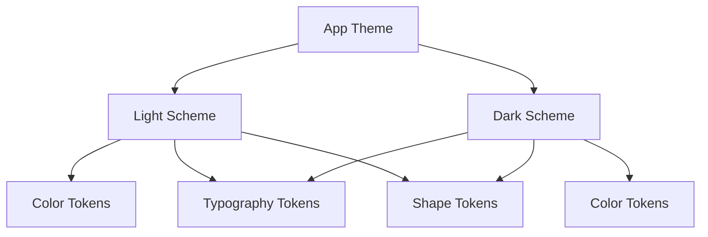
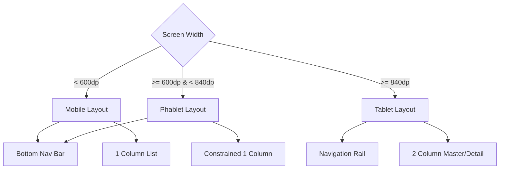

# FARMSTATS Design System Specification

## Document Control

**Version:** 1.0.0
**Status:** Draft
**Owner:** Staff Product Designer
**Revision History:**

| Version | Date       | Author                 | Changes                             |
| ------- | ---------- | ---------------------- | ----------------------------------- |
| 1.0.0   | 2026-07-28 | Staff Product Designer | Initial Design System Specification |

**Related Documents:**

- [BRD.md](../business/BRD.md)
- [SRS.md](../technical/SRS.md)
- [ARCHITECTURE.md](../technical/ARCHITECTURE.md)

---

## Brand Identity

**Vision**
To elevate the sericulture farming experience by providing a digital tool that feels as natural, robust, and essential as the physical tools used in the field.

**Brand Personality**
Trustworthy, grounded, modern, calm, and effortlessly powerful. FarmOS does not shout; it assists quietly and reliably.

**Design Philosophy**
Form follows workflow. Every pixel must serve the farmer's operational needs while stripping away cognitive overhead. We believe enterprise tools should possess consumer-grade aesthetics.

**Visual Language**
Rooted in Material Design 3 (M3) but highly customized to reflect agricultural contexts—utilizing deep, organic greens, earthy neutrals, and high-contrast typography to ensure field legibility.

**Product Feel**
Premium, snappy, and tactile. The application should feel like a high-end physical ledger.

**Tone**
Direct, encouraging, clear, and vernacular-ready. We avoid technical jargon in favor of operational clarity.

---

## Design Principles

- **Fast:** Interactions must respond under 100ms. Transitions are swift and purposeful.
- **Simple:** Progressive disclosure. Show only what is needed _now_.
- **Premium:** Utilize deliberate negative space, elegant typography, and subtle shadows.
- **Farmer Friendly:** Speak the user's language. Eliminate unnecessary steps.
- **Minimal:** Remove all decorative elements that do not aid in navigation or comprehension.
- **Accessible:** Exceed WCAG AA standards. High contrast is non-negotiable for outdoor visibility.
- **Large Touch Targets:** Minimum 48x48 dp for all interactive elements to accommodate calloused hands or gloves.
- **Consistency:** A button must look and behave like a button across the entire ecosystem.
- **Delightful Micro Interactions:** Provide subtle haptic and visual feedback (e.g., a gentle bounce on save) to confirm user actions securely.

---

## Color System

The FarmOS palette is grounded in nature but optimized for digital contrast.

### Color Tokens & Usage

#### Primary (Brand & Action)

- `Primary`: `#2E7D32` (Deep Forest Green) - Used for FABs, primary buttons, active states.
- `OnPrimary`: `#FFFFFF` - Text/icons resting on Primary.
- `PrimaryContainer`: `#C8E6C9` - Used for active navigational elements.
- `OnPrimaryContainer`: `#1B5E20` - Text resting on Primary Container.

#### Secondary (Subdued UI Elements)

- `Secondary`: `#558B2F` (Olive Green) - Used for secondary chips, progress indicators.
- `OnSecondary`: `#FFFFFF`
- `SecondaryContainer`: `#DCEDC8`
- `OnSecondaryContainer`: `#33691E`

#### Tertiary (Accents & Highlights)

- `Tertiary`: `#F9A825` (Warm Sun Yellow) - Used for highlights, active batch statuses.
- `OnTertiary`: `#FFFFFF`
- `TertiaryContainer`: `#FFF9C4`
- `OnTertiaryContainer`: `#F57F17`

#### Semantic (Status)

- `Success`: `#4CAF50` - Positive trends, completed tasks.
- `Warning`: `#FF9800` - Low inventory, pending actions.
- `Error`: `#D32F2F` - Destructive actions, validation failures, high mortality.
- `OnError`: `#FFFFFF`

#### Surfaces & Backgrounds

- `Background`: Light: `#FBFDF8` / Dark: `#121411` - The absolute base of the app.
- `Surface`: Light: `#F4F7F2` / Dark: `#1A1D19` - Cards, sheets, dialogs.
- `SurfaceContainer`: Light: `#ECEFEC` / Dark: `#232622` - Grouped sections within surfaces.

#### Outline & Disabled

- `Outline`: `#737971` - Input borders, dividers.
- `DisabledContainer`: `#E0E3DF` (Light) / `#333632` (Dark)
- `OnDisabled`: `#A1A5A0` (Light) / `#636662` (Dark)

### Light vs Dark Theme

- **Light Theme:** High contrast, crisp whites, and deep greens. Optimized for direct sunlight.
- **Dark Theme:** Deep charcoal backgrounds with desaturated greens to reduce eye strain in low-light environments. True blacks `#000000` are avoided in favor of `#121411` to prevent OLED smearing while maintaining depth.

---

## Typography

**Typeface:** `Inter` (sans-serif). Chosen for its excellent legibility at small sizes and robust numerical figures (crucial for ledgers).

### Hierarchy & Tokens

| Scale           | Font Size | Weight        | Tracking | Line Height | Usage                           |
| --------------- | --------- | ------------- | -------- | ----------- | ------------------------------- |
| Display Large   | 57px      | Regular (400) | -0.25px  | 64px        | Hero metrics (Dashboard totals) |
| Display Medium  | 45px      | Regular (400) | 0.0px    | 52px        | Empty states hero text          |
| Headline Large  | 32px      | SemiBold(600) | 0.0px    | 40px        | Page titles, Dialog Headers     |
| Headline Medium | 28px      | SemiBold(600) | 0.0px    | 36px        | Section headers                 |
| Title Large     | 22px      | Medium (500)  | 0.0px    | 28px        | Card titles, App Bar            |
| Title Medium    | 16px      | Medium (500)  | 0.15px   | 24px        | List tile headers               |
| Body Large      | 16px      | Regular (400) | 0.5px    | 24px        | Standard paragraph text         |
| Body Medium     | 14px      | Regular (400) | 0.25px   | 20px        | Secondary list text, notes      |
| Label Large     | 14px      | Medium (500)  | 0.1px    | 20px        | Button text, Tabs               |
| Label Medium    | 12px      | Medium (500)  | 0.5px    | 16px        | Badge text, Chips               |
| Caption         | 11px      | Regular (400) | 0.4px    | 16px        | Timestamp, ultra-small hints    |

---

## Spacing System

Based strictly on the **8pt Grid** for layout, and the **4pt Grid** for micro-positioning.

- `spacing-xs`: 4px (Icon to text gap)
- `spacing-sm`: 8px (Between chips, vertical list items)
- `spacing-md`: 16px (Standard padding inside cards, standard screen margins)
- `spacing-lg`: 24px (Between distinct sections)
- `spacing-xl`: 32px (Bottom of page padding, hero spacing)
- `spacing-xxl`: 48px (Major structural gaps)

### Margins & Padding

- **Screen Margins:** 16px on phones, 24px on tablets.
- **Card Padding:** 16px universal.

---

## Elevation System

Instead of relying solely on drop shadows, FarmOS utilizes a combination of surface color tinting (M3 style) and subtle blurring to establish depth.

- **Level 0 (0dp):** `Background`. Screens, standard text.
- **Level 1 (1dp):** `Surface`. Cards, List Tiles. (Slightly tinted background color).
- **Level 2 (3dp):** Bottom App Bar, Search Bar. (Tint + subtle 4px blur shadow).
- **Level 3 (6dp):** Floating Action Buttons (FAB), Dialogs. (Tint + 8px blur shadow).
- **Level 4 (8dp):** Navigation Drawers, Bottom Sheets.
- **Glass Effects:** Used exclusively for Sticky Headers or floating snackbars. Requires 80% opacity with a background blur filter of 10px.

---

## Corner Radius

FarmOS leans towards approachable, rounded aesthetics to offset the heavy data focus.

- `radius-xs` (4px): Checkboxes, small badges.
- `radius-sm` (8px): Text Inputs, Dropdowns.
- `radius-md` (12px): Standard Cards, Dialogs, List Tiles.
- `radius-lg` (16px): Bottom Sheets, Image containers.
- `radius-pill` (999px): Buttons, Chips, FABs.

---

## Iconography

### Material Symbols (Rounded)

- **Usage Rules:** Icons must always be accompanied by text labels unless universally understood (e.g., Back Arrow, Close 'X').
- **Style:** `Rounded` style utilized universally to match the Corner Radius system.
- **Weights:**
  - Standard UI: `Filled`, Weight 400.
  - Active States (e.g., Bottom Nav active): `Filled`, Weight 600.
  - Inactive States: `Outlined`, Weight 400.
- **Sizes:**
  - `icon-sm`: 16px (Inside chips, inline with text)
  - `icon-md`: 24px (Standard, App Bar, Nav Bar)
  - `icon-lg`: 32px (Empty states, Dashboard KPIs)

---

## Components

- **Buttons:** Pill-shaped (`radius-pill`). `Primary` (Filled), `Secondary` (Tonal Container), `Tertiary` (Text only). Min height 48px.
- **Text Fields:** `Outlined` variant only. 8px radius. Active border is `Primary` 2px. Error border is `Error` 2px.
- **Dropdown:** Matches Text Field styling. Native OS picker invoked on tap.
- **Cards:** 12px radius. `Elevated` (Level 1 shadow) or `Outlined` (Level 0, 1px outline).
- **List Tiles:** Minimum height 72px for touch accessibility. Optional leading icon (40x40px circular container).
- **FAB:** Primary color, Pill-shaped (Extended) with Label + Icon.
- **Dialogs:** 12px radius, dimmed scrim (60% black). Max width 400px.
- **Bottom Sheets:** Modal, 16px top-radius. Features a 32x4px drag handle at the top.
- **Date Picker:** Full-screen modal on mobile, centered dialog on tablet.
- **Search Bar:** Pill-shaped, Level 2 elevation, always visible on list screens.
- **Segmented Controls:** Pill-shaped container, sliding active indicator.
- **Chips:** 32px height, 8px radius. Used for filtering and status indicators.
- **Badges:** 16px height, pill-shaped, placed top-right of icons.
- **Progress:** Circular for local loads, Linear (Top of screen) for page transitions.
- **Skeleton Loader:** Subtle pulsing gray shapes matching the layout of the loading content.
- **Snackbar:** Floating pill, bottom center, Level 3 elevation. Auto-dismiss after 4s.
- **Toast:** Not used. (Snackbars replace all toasts).
- **Empty State:** Centered layout: 120px illustration/icon -> Title Large -> Body Medium -> Primary Action Button.
- **Error State:** Similar to Empty State, colored heavily in semantic Error tones.
- **Data Tables:** Used strictly on Tablet/Landscape. Mobile uses List View.
- **Charts:** Embedded in cards, no borders, scrollable horizontally if data exceeds viewport.
- **Navigation Bar (Bottom):** 3-4 destinations max. Icon + Label always visible.
- **Navigation Rail:** Used strictly on Tablet/Landscape mode.
- **Drawer:** Not used. (Bottom Navigation preferred for reachability).
- **Floating Panels:** Used on Tablet for master-detail views.

---

## Motion

- **Duration:**
  - `Fast`: 150ms (Button taps, checkbox toggles).
  - `Standard`: 250ms (Dialogs, Sheets, routing transitions).
  - `Slow`: 400ms (Hero animations, complex layout shifts).
- **Curves:**
  - `Emphasized Decelerate` (Incoming elements): Fast out, slow in.
  - `Emphasized Accelerate` (Outgoing elements): Slow out, fast in.
- **Transitions:** Fade-Through for top-level navigation. Shared Axis (X or Y) for sibling screens.
- **Page Animation:** Slide up and fade in for deep navigation.
- **Hero Animation:** Shared Element Transitions used when tapping a Batch card to enter Batch Details.
- **List Animation:** Staggered fade-in (50ms delay per item) on initial load.

---

## Accessibility

- **Contrast:** Text against background must meet 4.5:1 ratio (AA).
- **Touch Target:** Absolute minimum 48x48 dp. No exceptions.
- **Screen Reader:** All non-text elements must have `Semantics` labels explicitly defined (e.g., `aria-label="Add Expense"`).
- **Dynamic Text:** UI must scale gracefully up to 200% font size without breaking layouts (text wraps, does not truncate).
- **Landscape/Tablet:** UI adapts to two-pane layouts; touch targets remain large.

---

## Responsive Rules

- **Small Phone (< 600dp):** Single column. Bottom Navigation Bar. Full-screen dialogs.
- **Large Phone / Phablet (600dp - 840dp):** Single column with constrained max-width (600px) for forms. Bottom Navigation Bar.
- **Tablet / Foldable (> 840dp):** Two-column layouts (Master-Detail). Navigation Rail on the left instead of Bottom Nav. Dialogs become centered modals.

---

## Dashboard Widgets

- **Standard Sizes:** Half-width (2 per row on mobile) or Full-width (1 per row).
- **Layout Rules:** Most critical metric (e.g., Active Batch Status) sits top-left.
- **Card Rules:** No nested scrolling within cards. Click whole card to drill down.
- **Charts:** Sparklines (mini line charts without axes) used for quick trend visibility.
- **KPIs:** Large typography (Display Medium), semantic coloring (Green/Red arrows) for trend indication.

---

## Forms

- **Validation:** Real-time on blur (not on keystroke to avoid early error flashing).
- **Keyboard Types:** Auto-invoke `number_pad` for Amount/Weight. Invoke `text_cap_words` for Names/Notes.
- **Error Messages:** Explicit string below the text field. Input border turns Red.
- **Required Fields:** Marked with a red asterisk `*`. Save button disabled until all required fields are valid.
- **Success:** Haptic pop + Snackbar confirmation + automatic navigation pop.

---

## Chart Guidelines

- **Colors:** Avoid complex palettes. Use `Primary` for Income, `Error` for Expenses, `Secondary` for generic data.
- **Bar:** Used for categorical comparison (e.g., Expenses by Category).
- **Line:** Used for temporal trends (e.g., Yield over last 5 batches).
- **Pie:** Avoid unless exactly 2-3 categories (e.g., Income vs Expense).
- **Area:** Used to show volume over time (e.g., Inventory depletion).
- **Animation:** Charts "grow" from the baseline over 400ms on initial render.
- **Legends:** Placed below the chart, interactive (tap to toggle series visibility).

---

## Design Tokens (JSON Representation Concept)

```json
{
  "spacing": { "xs": 4, "sm": 8, "md": 16, "lg": 24, "xl": 32 },
  "radius": { "xs": 4, "sm": 8, "md": 12, "pill": 999 },
  "elevation": { "level0": 0, "level1": 1, "level2": 3, "level3": 6 },
  "typography": { "fontFamily": "Inter" }
}
```

---

## Figma Structure

To maintain sync between design and engineering, the Figma file must adhere to this structure:

- **Pages:**
  - `Cover` (Thumbnail)
  - `📖 Guidelines` (Rules & Tokens)
  - `🧩 Components` (Master components)
  - `📱 Mobile Flows` (Core screens)
  - `💻 Tablet Flows` (Responsive layouts)
  - `🗑️ Archive`
- **Components:** Grouped by anatomical type (e.g., `Inputs/TextField`, `Navigation/BottomBar`).
- **Variants:** Utilized for States (Default, Hover, Active, Disabled, Error).
- **Auto Layout:** Mandatory for all components and frames to simulate Flexbox behavior.
- **Naming Convention:** `Category / Component / Variant` (e.g., `Button / Primary / Disabled`).

---

## Mermaid Diagrams

### Component Hierarchy



### Theme Structure



### Layout Structure (Responsive)


