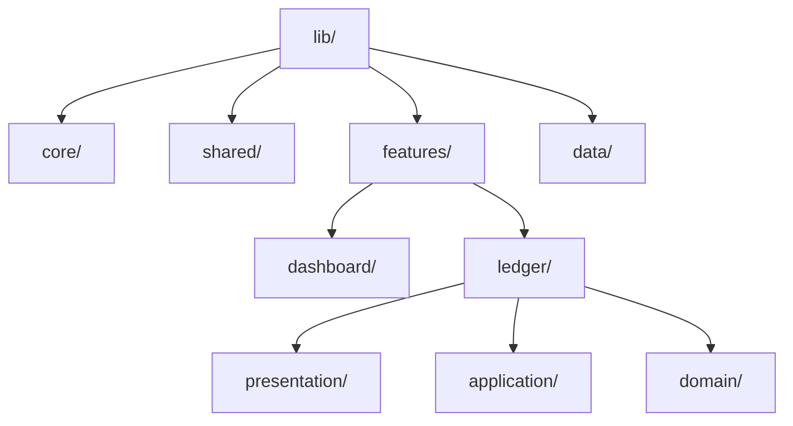
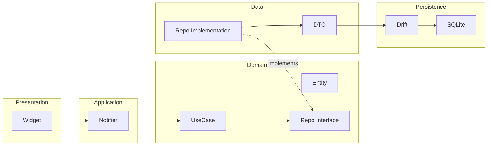
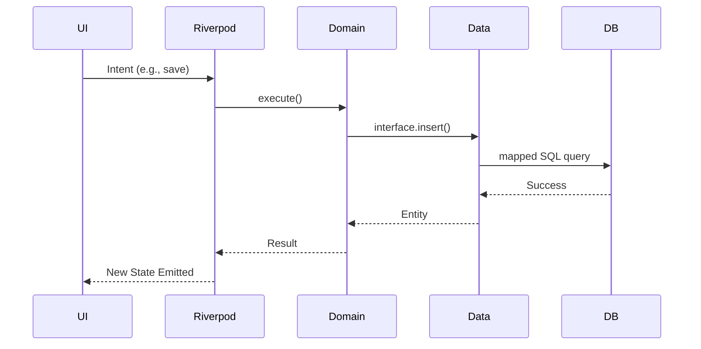
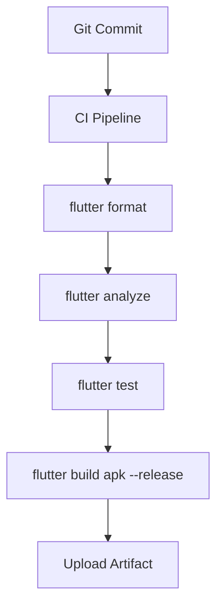

# FARMSTATS Development Guidelines

## Document Control

**Version:** 1.0.0
**Status:** Draft
**Owner:** Principal Software Architect
**Related Documents:** [ARCHITECTURE.md](../technical/ARCHITECTURE.md), [SRS.md](../technical/SRS.md)

---

## Engineering Philosophy

FarmOS is built on the principles of **Predictability, Immutability, and Strict Decoupling**.

- **Type Safety is Absolute:** Use strict typing. `dynamic` is strictly forbidden.
- **Immutability by Default:** All models, states, and widgets must be immutable. Use `freezed` for data classes.
- **Composition over Inheritance:** Build complex UI and logic by composing small, single-purpose components.
- **Fail Fast, Fail Safely:** Catch errors at compile-time when possible. If runtime errors occur, they must be gracefully caught and logged without crashing the app.
- **Zero-Trust UI:** The Presentation layer cannot be trusted to perform business logic. It must only emit intents and react to state.

---

## Folder Structure

```text
lib/
├── core/                   # Foundation of the app
│   ├── constants/          # Global constants, API keys (if any), metrics
│   ├── errors/             # Custom exception classes and failure models
│   ├── network/            # Network info (connectivity checkers)
│   ├── theme/              # ThemeData, color schemes, text themes
│   └── utils/              # Pure utility functions (formatting, validation)
├── shared/                 # Reusable cross-feature components
│   ├── widgets/            # Dumb UI components (Buttons, Inputs, Cards)
│   └── extensions/         # Dart extensions (e.g., DateTime extensions)
├── features/               # Domain-driven feature modules
│   ├── [feature_name]/     # e.g., 'dashboard', 'ledger', 'batches'
│   │   ├── presentation/   # Screens, local widgets, Riverpod UI controllers
│   │   ├── application/    # Riverpod Notifiers, Use Cases, State definitions
│   │   ├── domain/         # Entities, Repository Interfaces
│   │   └── data/           # DTOs, Repository Implementations specific to feature
├── data/                   # Global data layer implementations
│   ├── local_db/           # Drift database, Tables, DAOs, Migrations
│   └── secure_storage/     # Key-value storage implementation
└── main.dart               # App entry point, ProviderScope, root widget
```

**Explanation:** This structure marries Clean Architecture with Feature-First organization. The `features/` directory contains isolated vertical slices of the app, while `core/`, `shared/`, and `data/` handle cross-cutting concerns.

---

## Naming Conventions

- **Files:** `snake_case.dart` (e.g., `expense_list_screen.dart`).
- **Classes:** `UpperCamelCase` (e.g., `ExpenseListScreen`).
- **Widgets:** `UpperCamelCase` ending in `Screen`, `Widget`, `Card`, etc. (e.g., `BatchDetailCard`).
- **Riverpod Providers:** `camelCaseProvider` (e.g., `expenseNotifierProvider`).
- **Repositories:** `UpperCamelCaseRepository` (e.g., `FinancialRepository`).
- **Use Cases:** `UpperCamelCaseUseCase` (e.g., `AddExpenseUseCase`).
- **Models/Entities:** `UpperCamelCase` (e.g., `ExpenseEntity`).
- **Enums:** `UpperCamelCase` (e.g., `BatchStatus`).
- **Extensions:** `UpperCamelCaseX` (e.g., `DateTimeX`).
- **Utilities:** `camelCase` for functions (e.g., `formatCurrency()`).
- **Assets:** `snake_case` (e.g., `ic_arrow_back.svg`).

---

## Flutter Standards

- **Widget Structure:** Separate complex screens into private local widgets or components. Never exceed 300 lines in a single widget file.
- **Widget Size:** Avoid deep nesting. Extract widget trees into separate `StatelessWidget` classes rather than helper methods returning `Widget` to leverage the framework's element tree diffing.
- **Composition:** Compose UIs using atomic Shared Widgets rather than building raw containers everywhere.
- **Const Constructors:** `const` must be used universally for all static widgets to minimize the rebuild tree. Lint rules must enforce this.
- **Immutability:** All fields in a widget must be `final`.
- **Build Method Rules:** The `build` method must be pure. NO business logic, NO asynchronous calls, NO state mutation inside `build`.
- **State Separation:** Avoid `StatefulWidget` where possible. Move ephemeral UI state (like form inputs) into Riverpod `Notifier` or `flutter_hooks`.

---

## Riverpod Standards

- **Provider Naming:** Must suffix with `Provider`.
- **StateNotifier:** Deprecated. Do not use.
- **Notifier / AsyncNotifier:** Use the new Riverpod 2.0 architecture exclusively.
- **Provider Scope:** Only one `ProviderScope` at the root, unless explicitly scoping for list optimization.
- **Caching:** Use `ref.keepAlive()` for expensive queries (e.g., Reports) to prevent re-fetching on rapid navigation.
- **Invalidation:** Use `ref.invalidate(provider)` explicitly after a successful database write to force dependent UI views to refresh automatically.

---

## Drift Standards

- **Table Naming:** Plural `UpperCamelCase` for class definitions (e.g., `Expenses`), mapped to `snake_case` in SQL.
- **DAO Rules:** Data Access Objects must be segregated by domain (e.g., `FinancialDao`, `BatchDao`). Do not bloat the core Database class.
- **Repository Pattern:** DAOs must never be exposed to the Application layer. They must be wrapped by Repository Implementations.
- **Transactions:** Use `transaction()` for any operation involving multiple inserts/updates to guarantee ACID properties.
- **Migrations:** Never alter an existing table schema without bumping `schemaVersion` and writing an explicit migration step in `onUpgrade`.
- **Indexes:** Define `@Index` annotations on foreign keys and frequently filtered columns (e.g., dates).

---

## Repository Pattern

- **Rules:** The Domain layer defines the abstract interface (e.g., `abstract class FinancialRepository`). The Data layer implements it.
- **Responsibilities:** The Repository maps Domain Entities to Data Transfer Objects (DTOs/Drift classes) for writing, and maps DTOs back to Entities for reading. It catches SQLite exceptions and throws custom Domain exceptions.
- **Examples:** `insertExpense(ExpenseEntity entity)` -> converts to `ExpensesCompanion` -> calls DAO.

---

## Error Handling

- **Global:** `PlatformDispatcher.instance.onError` must catch all uncaught synchronous and asynchronous errors and route them to the Logger.
- **Database:** `drift` exceptions (e.g., unique constraint violations) are caught in the Repository and rethrown as `DataException`.
- **Validation:** Synchronous business rules failing (e.g., negative amount) throw `ValidationException` from the Use Case.
- **Unexpected:** UI displays a generic fallback via `AsyncError` mapping (e.g., "An unexpected error occurred"). Stack traces are NEVER shown in production UI.

---

## Logging Standards

- **Levels:** `verbose`, `debug`, `info`, `warning`, `error`, `wtf`.
- **Formatting:** `[Timestamp] [Level] [Tag]: Message`.
- **Debug:** Full stack traces, SQL query logs, and Riverpod state transitions are printed to the console.
- **Production:** No console output. Critical errors are written to a rolling local `.log` file in the device's secure storage for user-initiated diagnostic export.

---

## Performance Rules

- **Lazy Loading:** Use `ListView.builder` or `SliverList` exclusively for ledgers. Never use `ListView(children: [])`.
- **Pagination:** Implement SQLite `OFFSET/LIMIT` via Riverpod pagination for lists exceeding 100 items.
- **Memory:** Dispose of heavy resources (e.g., PDF generators) immediately. Rely on `autoDispose` providers.
- **Widget Rebuilds:** Use `ref.select()` to listen only to specific properties of a state object, preventing full widget rebuilds.
- **Images:** SVG preferred. If raster images are used, cache them explicitly.
- **Animations:** Strictly use `AnimatedBuilder` or implicitly animated widgets. Never call `setState` in a loop.
- **Database:** Avoid `JOIN`s on unindexed columns.

---

## Accessibility Rules

- **Semantics:** Wrap ambiguous widgets (like custom icons) in `Semantics` providing a descriptive `label`.
- **Scaling:** UI layouts must not break when the device font size is scaled to 200%. Use `Expanded`, `Flexible`, and `Wrap` extensively.

---

## Security Rules

- **Database:** Encrypted via SQLCipher. The 256-bit key is generated securely and stored in the Android Keystore via `flutter_secure_storage`.
- **Memory:** Clear sensitive data (like backup passwords) from memory immediately after use.

---

## Testing Rules

- **Unit:** Cover 100% of Domain Use Cases, Application Notifiers, and Utility functions.
- **Widget:** Test reusable Shared Widgets to ensure they react correctly to varied inputs and themes.
- **Integration:** E2E testing of critical paths (e.g., Database initialization -> Create Batch -> Log Expense -> Verify Dashboard).
- **Golden:** Use Golden tests for complex components (e.g., Charts) to prevent visual regressions.
- **Repository:** Test Data layers using an in-memory SQLite Drift instance.

---

## Git Standards

- **Branch Strategy:** `main` (Production), `develop` (Integration), `feature/[ticket-id]-[short-desc]`, `bugfix/[ticket-id]-[short-desc]`.
- **Commit Convention:** Conventional Commits required (e.g., `feat(ledger): add expense validation`, `fix(db): resolve migration conflict`).
- **Pull Request:** Must include description, screenshots (if UI changed), and link to ticket.
- **Release Tags:** Semantic versioning (e.g., `v1.2.0`).

---

## Documentation Standards

- **DartDoc:** All public classes, methods, and providers must have `///` documentation explaining _why_ it exists and its inputs/outputs.

---

## Code Review Checklist

- [ ] Does it compile without warnings?
- [ ] Are all new widgets using `const`?
- [ ] Is business logic kept out of the UI?
- [ ] Are tests passing and new code covered?
- [ ] Were strings localized (no hardcoded strings)?
- [ ] Were responsive layout rules tested?

---

## Definition of Done (DoD)

A feature is complete when:

1. Code meets all architectural guidelines.
2. Unit and Widget tests are written and pass.
3. Feature is manually tested on a physical Android device.
4. UI matches Figma Design System specifications exactly.
5. Code Review is approved by at least one peer.
6. Merged into `develop`.

---

## Mermaid Diagrams

### Diagram: Folder Structure



### Architecture



### Code Flow



### Build Flow


