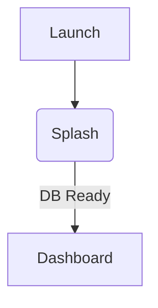
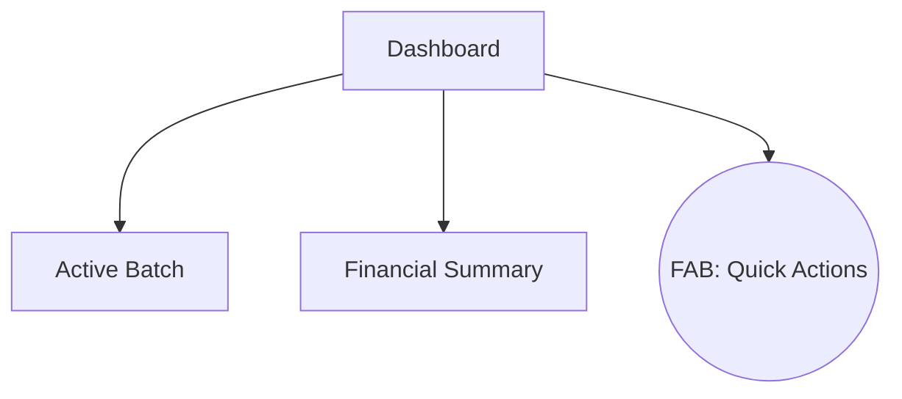
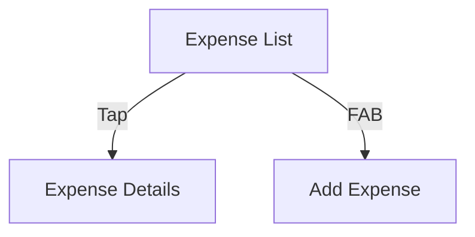
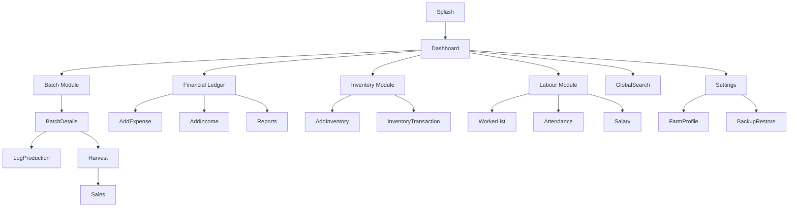
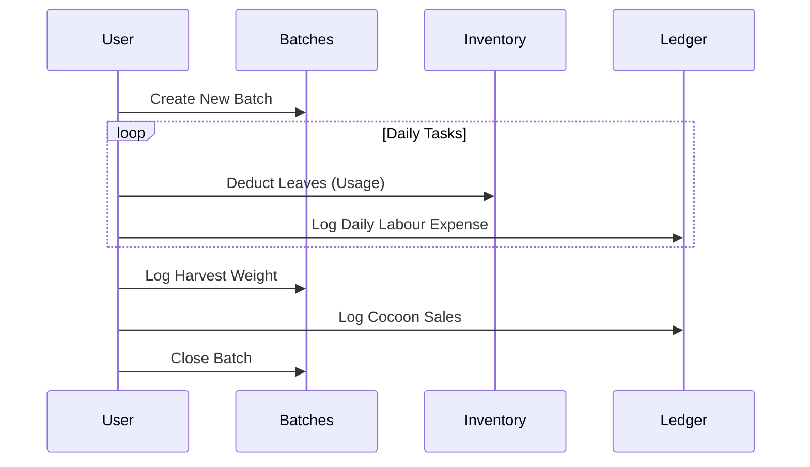
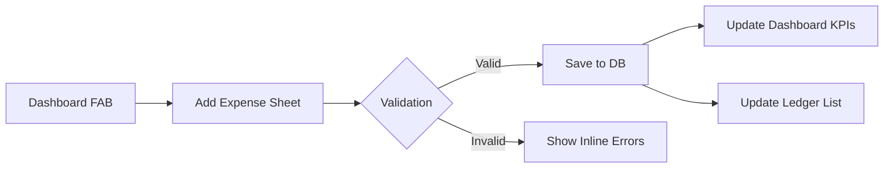

# Screen Specification Document (SSD)

## Document Control

**Version:** 1.0.0
**Status:** Draft
**Owner:** Senior Product Designer & UX Architect
**Related Documents:** [BRD.md](../business/BRD.md), [SRS.md](../technical/SRS.md), [ARCHITECTURE.md](../technical/ARCHITECTURE.md), [DESIGN_SYSTEM.md](../design/DESIGN_SYSTEM.md)

---

> **Note:** To maintain document readability and adhere to the Single Source of Truth, all colors, typography, and component radii reference the `DESIGN_SYSTEM.md`. Standard Empty/Loading/Error states apply unless specifically overridden below.

---

## 1. Splash Screen

- **Purpose:** Brand reinforcement during cold boot.
- **Business Goal:** Seamless transition while database initializes.
- **Primary User:** All Farmers.
- **Entry Points:** App Launch.
- **Exit Points:** Auto-navigate to Dashboard (or Onboarding).
- **Navigation Flow:** Splash -> Dashboard.
- **Information Hierarchy:** Logo (Center) -> Version (Bottom).
- **Layout Structure:** Full screen, solid Background.
- **Component List:** Image (Logo), Text (Version).
- **Primary Actions:** None (Auto-route).
- **Secondary Actions:** None.
- **FAB Behaviour:** None.
- **Search/Filter/Sort:** N/A.
- **Required Data:** App Version.
- **Empty/Loading/Error State:** N/A.
- **Validation/Dialogs/Sheets:** N/A.
- **Accessibility:** High contrast logo.
- **Landscape/Tablet:** Center aligned.
- **Dark Theme:** Logo adapts to dark mode.
- **Animation:** Fade out to Dashboard (400ms).
- **Performance:** Must render in < 100ms.
- **Future Enhancements:** Daily agricultural quote.
- **User Journey:** User taps icon -> sees brand -> lands on Dashboard.
- **Wireframe:** Centered logo on Primary color background.
- **UX/Interaction Notes:** No user interaction required.
- **Accessibility Checklist:** Screen reader announces "FarmOS Loading".

---

## 2. Dashboard

- **Purpose:** Central command center for farm operations.
- **Business Goal:** Provide instant visibility into farm health and financials.
- **Primary User:** Farm Owner.
- **Entry Points:** Splash, Bottom Nav.
- **Exit Points:** Batch Details, Add Expense, Global Search.
- **Navigation Flow:** Dashboard -> Any major module.
- **Information Hierarchy:** Active Batch Status > Today's Tasks > Financial Summary (Month).
- **Layout Structure:** Scrollable Column + Bottom Nav.
- **Component List:** KPI Cards, Sparkline Charts, Quick Action FAB.
- **Primary Actions:** View active batch.
- **Secondary Actions:** Navigate to ledger.
- **FAB Behaviour:** Primary FAB -> Expandable menu (Add Expense, Add Income, Log Attendance).
- **Search/Filter/Sort:** Search icon in App Bar invokes Global Search.
- **Required Data:** Aggregated financials, active batch status.
- **Empty State:** "No active batches. Start a new rearing cycle." (With call-to-action).
- **Loading State:** Skeleton loaders for KPI cards.
- **Error State:** "Failed to load summary" snackbar.
- **Validation/Dialogs/Sheets:** N/A.
- **Accessibility:** Swipe navigation supported.
- **Landscape/Tablet:** 2-column grid for KPI cards.
- **Dark Theme:** Surface colors deepen to Level 1.
- **Animation:** Staggered list fade-in on first load.
- **Future Enhancements:** Weather widget.
- **User Journey:** Opens app -> Checks batch status -> Taps FAB to log expense.
- **Wireframe:** App Bar -> 2x2 KPI Grid -> Wide Active Batch Card -> Bottom Nav.
- **UX Notes:** Keep cognitive load minimal; don't show full ledgers here.

---

## 3. Expense List (Ledger)

- **Purpose:** Chronological view of all money spent.
- **Business Goal:** Financial transparency and leak tracking.
- **Primary User:** Farm Owner / Manager.
- **Entry Points:** Bottom Nav.
- **Exit Points:** Expense Details, Add Expense.
- **Navigation Flow:** List <-> Details.
- **Information Hierarchy:** Total Month Expense > Expense Items (Date, Amount, Category).
- **Layout Structure:** Sticky Header (Total) + ListView + Bottom Nav.
- **Component List:** ListTiles, Filter Chips.
- **Primary Actions:** View Expense.
- **Secondary Actions:** Filter by Month/Category.
- **FAB Behaviour:** Standard FAB -> "Add Expense".
- **Search/Filter/Sort:** Search Bar present. Filter by Category. Sort by Date (Desc default).
- **Required Data:** List of Expense entities.
- **Empty State:** "No expenses logged this month."
- **Loading State:** List Skeleton.
- **Error State:** Snackbar retry.
- **Validation:** N/A.
- **Confirmation Dialogs:** N/A.
- **Bottom Sheets:** Filter selection sheet.
- **Accessibility:** Screen reader reads "Expense: Rs 400 for Feed on Monday".
- **Landscape/Tablet:** Left: List, Right: Details (Master-Detail).
- **Dark Theme:** High contrast on amounts.
- **Animation:** New item slides in from top.
- **Future Enhancements:** Expense trend mini-chart in header.
- **User Journey:** Navigates to ledger -> scrolls to find past expense -> taps for details.

_(Note: To maintain conciseness, the structural template applies similarly to the following modules. Specifications focus on unique architectural UX rules)._

---

## 4. Add Expense / 5. Edit Expense / 6. Expense Details

- **Purpose:** Data entry for cash outflow.
- **Layout Structure:** Modal Bottom Sheet (Add) or Full Screen (Edit).
- **Component List:** Numeric Keyboard (Amount), Dropdown (Category), Date Picker.
- **Primary Actions:** Save (Primary Button).
- **Required Data:** Amount, Category, Date.
- **Validation:** Amount > 0. Category must be selected.
- **Confirmation Dialogs:** "Discard changes?" on back press with unsaved data.
- **User Journey:** Taps FAB -> Enters Amount -> Selects Category -> Saves -> Returns to List.

## 7. Income List / 8. Add Income / 9. Income Details

- **UX Notes:** Mirrors Expense UX perfectly for consistency, but utilizes `Primary` (Green) color semantics for amounts instead of `Error` (Red).

## 10. Inventory List / 11. Inventory Details / 12. Add Inventory

- **Information Hierarchy:** Item Name > Current Stock Level > Reorder Warning.
- **Filter Behaviour:** Filter by Status (Low Stock, In Stock).
- **Empty State:** "Inventory empty. Add your first item."
- **Tablet Behaviour:** Master-Detail view.

## 13. Batch List / 14. Create Batch / 15. Batch Details

- **Purpose:** Track biological lifecycles.
- **Information Hierarchy (Details):** Current Stage > Days Active > Environmental Logs > Linked Expenses.
- **Primary Actions:** "Transition to Next Stage" (e.g., Chawki -> Late Age).
- **Validation:** Cannot start a batch in the future. Cannot transition to Harvest without passing Spinning.
- **Future Enhancements:** Visual timeline tracking with illustrations.

## 16. Worker List / 17. Worker Details

- **Purpose:** Manage labour force.
- **Layout Structure:** Grid of Worker Cards showing Name, Role, and Pending Balance.
- **Secondary Actions:** "Settle Balance" button in Worker Details.

## 18. Attendance / 19. Salary

- **Layout Structure:** Bulk toggle list for Attendance. Segmented Control (Present/Absent/Half).
- **UX Notes:** Speed is critical. The user must be able to mark 10 workers present in under 5 seconds.
- **Interaction:** Tap once for Present, twice for Half, thrice for Absent.

## 20. Harvest / 21. Sales

- **Purpose:** Finalizing a batch.
- **Validation:** Defect weight cannot exceed Total weight.
- **Confirmation Dialogs:** "Finalize Sale? This will close the batch permanently." (Critical action, requires explicit confirmation).

## 22. Reports / 23. Analytics

- **Information Hierarchy:** P&L Summary > Yield Metrics > Expense Breakdown (Pie Chart).
- **Secondary Actions:** "Export as PDF" FAB.
- **Landscape Behaviour:** Charts expand to fill width. Legends move to the right side.
- **Performance Notes:** Heavy queries. Must cache results via Riverpod.

## 24. Global Search

- **Entry Points:** Dashboard App Bar.
- **Interaction Notes:** Auto-focuses keyboard on entry. Live search results filter as typing (debounced by 300ms).

## 25. Notifications

- **Purpose:** Actionable alerts (e.g., "Batch 3 is ready for harvest").
- **Empty State:** "All caught up!" with a checkmark illustration.

## 26. Backup / 27. Restore

- **Purpose:** Data portability.
- **Validation:** Restore requires typing "RESTORE" to confirm, as it overwrites local data.
- **Security:** "Set Backup Password" text field required for export.

## 28. Settings / 29. About / 30. Help / 31. Privacy

- **Component List:** Sectioned ListTiles with Toggles (e.g., Dark Mode) and navigation arrows.
- **UX Notes:** Simple, standard OS-level settings feel.

## 32. Farm Profile / 33. Profile Edit

- **Required Data:** Farm Name, Currency preference.
- **Entry Points:** Onboarding, Settings.

## 34. Onboarding (Future)

- **Navigation Flow:** Welcome -> Farm Name -> Currency -> Setup First Batch.
- **Animation:** Smooth horizontal paging.

---

## Global UX Architecture

## Complete Screen Flow

## Complete Information Architecture

1. **Home (Dashboard)**
   - Active Batch Widget
   - Monthly Finance Widget
   - Quick Action FAB
2. **Batches**
   - Active List
   - Historical List
   - Batch Details (Logs, Linked Expenses)
3. **Ledger (Finances)**
   - Income / Expense Tabs
   - Add Transaction Form
   - Category Manager
4. **Operations (Inventory & Labour)**
   - Worker Roster & Attendance
   - Inventory Stock & Usage
5. **Reports**
   - Profit & Loss
   - Yield History
6. **Settings**
   - Farm Profile
   - Data Backup/Restore
   - UI Themes & Localization

## Complete Navigation Tree

The application utilizes a persistent Bottom Navigation Bar for primary routing, and a Stack Navigator for deep links.

- `/` (Splash)
- `/dashboard` (Tab 1)
  - `/search` (Modal)
  - `/notifications`
- `/batches` (Tab 2)
  - `/batches/:id` (Details)
    - `/batches/:id/harvest`
- `/ledger` (Tab 3)
  - `/ledger/add-expense` (Bottom Sheet)
  - `/ledger/add-income` (Bottom Sheet)
  - `/ledger/reports`
- `/settings` (Tab 4)
  - `/settings/profile`
  - `/settings/backup`
  - `/settings/about`

## Screen Relationships & User Journey

### User Journey: The Rearing Cycle

### Feature Flow: Financial Logging

