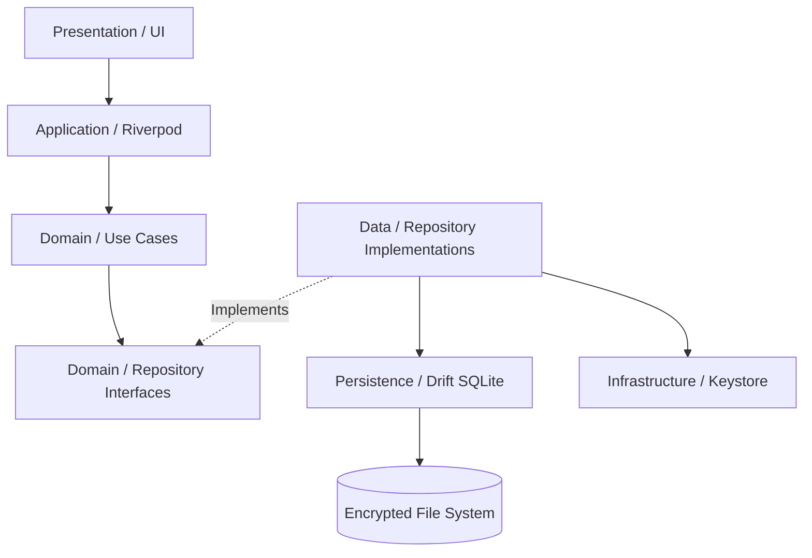
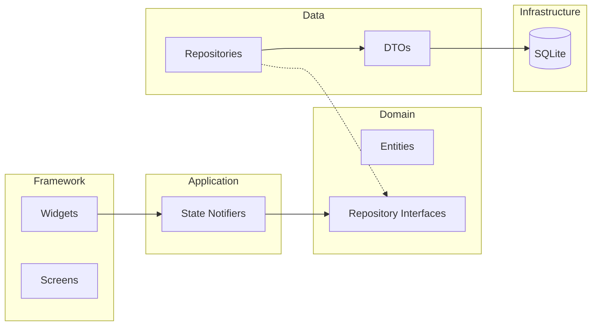
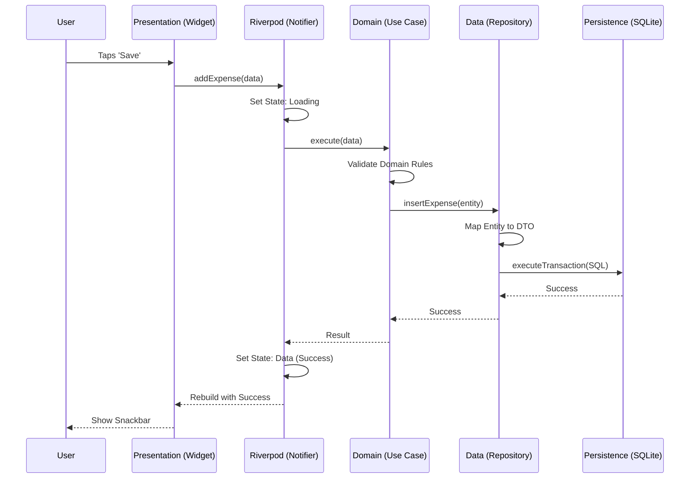
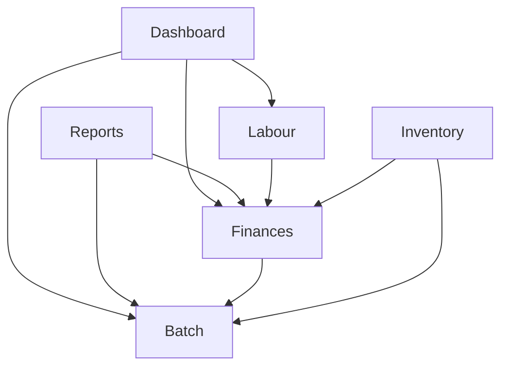
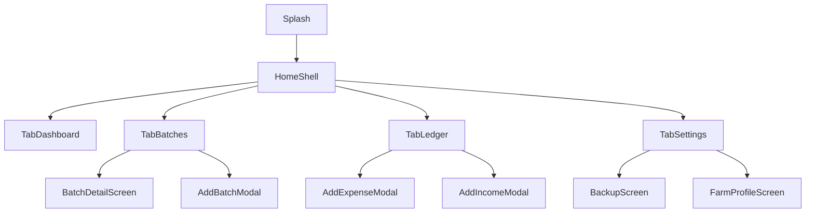
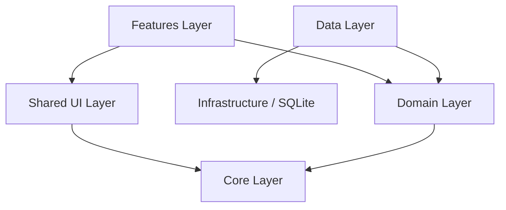
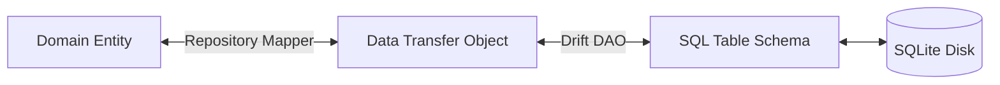
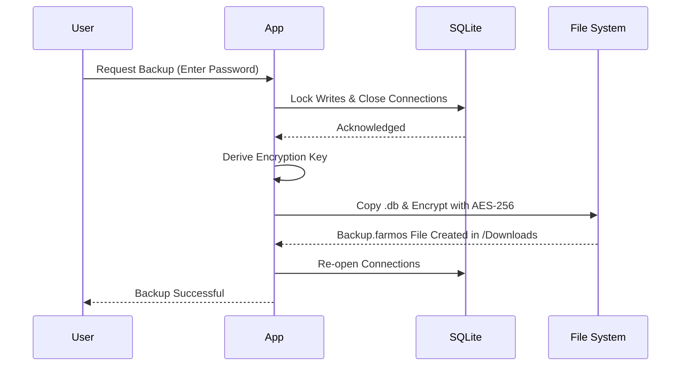

# Software Architecture Document (SAD)

## Document Control

**Version:** 1.0.0
**Status:** Draft
**Owner:** Principal Software Architect
**Revision History:**

| Version | Date       | Author              | Changes       |
| ------- | ---------- | ------------------- | ------------- |
| 1.0.0   | 2026-07-28 | Principal Architect | Initial Draft |

**Related Documents:**

- [BRD.md](../business/BRD.md)
- [SRS.md](SRS.md)
- Database.md (To be created)

---

## Executive Summary

This Software Architecture Document (SAD) provides a comprehensive architectural overview of FarmOS, an enterprise-scale offline-first mobile application designed for sericulture farmers. This document defines the structural decisions, design patterns, and systemic properties necessary to ensure high performance, maintainability, and data sovereignty. It serves as the primary technical blueprint for engineering teams, outlining the layered architecture, module composition, data flow, and infrastructure strategies required to deliver a robust, zero-connectivity ERP system.

---

## Architectural Goals

- **Performance:** Ensure UI rendering at a locked 60fps and database query execution in under 50ms on low-end ARM devices.
- **Scalability:** Design the local database schema and state management to handle thousands of ledger entries and multiple concurrent rearing batches without degradation.
- **Maintainability:** Enforce strict separation of concerns through Clean Architecture to facilitate parallel development and automated testing.
- **Offline First:** Treat local storage as the absolute source of truth, removing any dependency on external networks for core functionality.
- **Security:** Protect sensitive financial and operational data at rest using strong local encryption.
- **Reliability:** Implement ACID-compliant transactions to prevent data corruption during unexpected device failures or battery depletion.
- **Extensibility:** Architect feature modules loosely coupled to core layers to allow seamless future integration of P2P syncing or AI features.
- **Testability:** Decouple business logic from the UI and device dependencies to achieve >80% unit test coverage.

---

## Architecture Principles

- **SOLID:** Adhere strictly to Single Responsibility, Open/Closed, Liskov Substitution, Interface Segregation, and Dependency Inversion principles.
- **DRY (Don't Repeat Yourself):** Abstract shared UI components, utility functions, and common logic into the Shared and Core layers.
- **KISS (Keep It Simple, Stupid):** Avoid premature optimization or overly complex abstractions that do not serve the offline-first mandate.
- **YAGNI (You Aren't Gonna Need It):** Implement features and abstractions only when currently required by the BRD/SRS.
- **Clean Architecture:** Maintain a unidirectional dependency rule where outer layers (UI, Infrastructure) depend on inner layers (Domain, Use Cases).
- **Feature First:** Structure the codebase by feature rather than strictly by technical layer to improve domain coherence.
- **Repository Pattern:** Abstract the persistence layer behind interfaces to decouple the Domain from the specific database implementation (Drift/SQLite).
- **MVVM (Model-View-ViewModel):** Utilize a declarative UI pattern driven by reactive view states.
- **Single Source of Truth:** The local SQLite database is the only definitive source of data state.
- **Dependency Injection:** Inject dependencies at runtime to enhance testability and modularity.
- **Composition over Inheritance:** Build complex widgets and services by composing smaller, single-purpose components.

---

## High Level Architecture

The architecture is strictly layered to enforce separation of concerns and a unidirectional flow of dependencies.

- **Presentation Layer:** Contains all UI elements, screens, and widgets. It is entirely passive and only reacts to state changes emitted by the Application Layer.
- **Application Layer:** Contains state management (Riverpod), ViewModels (StateNotifiers), and orchestrates UI interactions by calling Domain Use Cases.
- **Domain Layer:** The pure core of the application. Contains business models, entities, and abstract Repository interfaces. It has zero dependencies on any other layer or third-party packages (except core Dart).
- **Data Layer:** Implements the Domain Repository interfaces. It fetches, maps, and caches data from the Persistence Layer and converts DTOs to Domain Entities.
- **Persistence Layer:** Manages the physical SQLite database using Drift. Handles SQL queries, schema migrations, and raw data transactions.
- **Core Layer:** Houses fundamental configurations, base classes, error handling definitions, and dependency injection setups used across the app.
- **Shared Layer:** Contains globally reusable UI components (e.g., standard buttons, typography), formatters, and extensions.
- **Infrastructure Layer:** Handles integrations with device hardware (File system for backups, secure storage, camera).

---

## Module Architecture

### Dashboard

- **Purpose:** Central command view providing daily summaries, active batch status, and quick actions.
- **Dependencies:** Relies on read-only aggregations from Batch, Financial, and Labour repositories.
- **Data Flow:** Reactively listens to aggregate streams. Does not directly mutate data.
- **Responsibilities:** High-level navigation and at-a-glance insights.
- **Future Extension:** Customizable widgets and proactive alerts.

### Expenses

- **Purpose:** Logging and categorizing outward cash flow.
- **Dependencies:** Financial Repository, Batch Repository (for linking).
- **Data Flow:** UI -> ExpenseNotifier -> AddExpenseUseCase -> FinancialRepository -> SQLite.
- **Responsibilities:** Form validation, category management, linking to active operations.
- **Future Extension:** Machine learning for receipt scanning (OCR).

### Income

- **Purpose:** Tracking cocoon sales and other revenue.
- **Dependencies:** Financial Repository, Batch Repository.
- **Data Flow:** Similar to Expenses, but strictly handles positive cash flow and yield metrics.
- **Responsibilities:** Accurate recording of yield weight and market rates.
- **Future Extension:** Market price integrations (when online).

### Inventory

- **Purpose:** Managing raw materials (leaves, disinfectants).
- **Dependencies:** Inventory Repository.
- **Data Flow:** Tracks inward (purchases) and outward (usage) movements.
- **Responsibilities:** Calculating current stock levels dynamically from ledger transactions.
- **Future Extension:** Barcode/QR scanning for quick inventory intake.

### Batch

- **Purpose:** The core sericulture biological lifecycle tracker.
- **Dependencies:** Batch Repository.
- **Data Flow:** Creates UUID-based batch records and handles linear state transitions.
- **Responsibilities:** Tracking dates, stages, and environmental observations.
- **Future Extension:** Automated environmental data logging via IoT.

### Production

- **Purpose:** Final yield and quality tracking per batch.
- **Dependencies:** Batch Repository, Financial Repository.
- **Data Flow:** Aggregates final harvest data before batch closure.
- **Responsibilities:** Calculating defect rates and net yield.
- **Future Extension:** Historical yield predictive modeling.

### Labour

- **Purpose:** Workforce attendance and wage management.
- **Dependencies:** Labour Repository.
- **Data Flow:** Logs daily binary attendance and calculates rolling wage balances.
- **Responsibilities:** Worker profiles and payout tracking.
- **Future Extension:** Biometric (fingerprint) attendance logging.

### Reports

- **Purpose:** Financial and operational analytics generation.
- **Dependencies:** All Repositories (Read-Only).
- **Data Flow:** Executes complex JOIN queries in the Persistence layer to generate aggregated DTOs.
- **Responsibilities:** Constructing Profit/Loss statements.
- **Future Extension:** Automated weekly PDF dispatches via local intent sharing.

### Analytics

- **Purpose:** Visual charts and graphical insights.
- **Dependencies:** Shared graphing libraries, Reporting Use Cases.
- **Data Flow:** Transforms reporting DTOs into chart data points.
- **Responsibilities:** Rendering interactive offline charts.
- **Future Extension:** Yield vs. Weather correlation analytics.

### Backup

- **Purpose:** Manual data preservation and restoration.
- **Dependencies:** Infrastructure Layer (File System), Persistence Layer.
- **Data Flow:** Locks database -> Encrypts -> Writes to `.farmos` file in Downloads -> Unlocks.
- **Responsibilities:** Ensuring data integrity during export and import.
- **Future Extension:** Automated local network backups to a secondary device.

### Settings

- **Purpose:** Application configuration and localization.
- **Dependencies:** SharedPreferences / SecureStorage.
- **Data Flow:** Read/Write key-value pairs.
- **Responsibilities:** Theme toggling, language selection, farm profile configuration.
- **Future Extension:** Multi-farm profile management.

### Search

- **Purpose:** Global entity discovery (find a specific expense or batch).
- **Dependencies:** All Repositories.
- **Data Flow:** Full-Text Search (FTS) queries across SQLite tables.
- **Responsibilities:** Providing instantaneous local search results.
- **Future Extension:** NLP-based query parsing ("Show expenses from last month").

---

## Folder Structure

```text
lib/
├── core/                   # App-wide configurations and base definitions
├── shared/                 # Reusable UI components and utilities
├── features/               # Feature-based module grouping
│   ├── dashboard/
│   ├── batch/
│   ├── finance/
│   ├── inventory/
│   ├── labour/
│   ├── reports/
│   └── settings/
├── data/                   # Data layer implementation
│   ├── local_db/           # Drift setup, DAOs, and raw queries
│   ├── repositories/       # Repository interface implementations
│   └── secure_storage/     # Encrypted key-value store
├── domain/                 # Pure business logic and models
│   ├── entities/
│   ├── repositories/
│   └── use_cases/
└── app.dart                # Main application widget and router setup
```

**Explanation:**

- **core/:** Contains error classes, network (if any), DI containers, and global constants.
- **shared/:** Houses the design system, common buttons, text styles, and formatters.
- **features/:** The heart of the app, organized by domain module. Each feature contains its own UI (screens/widgets) and Application layer (providers/notifiers).
- **data/:** Translates raw database outputs into Domain entities.
- **domain/:** Enterprise logic that dictates how the farm operates, completely independent of Flutter components.

---

## Package Structure

- **Core:** Error handling definitions, global logging, environment configuration.
- **Shared:** Common extensions (e.g., `DateTimeX`), generic mixins.
- **Features:** Grouping of domain-specific functionality.
- **Database:** Drift table definitions, DAOs, and schema migration logic.
- **Utils:** Helper functions (math, formatting, validation).
- **Widgets:** Passive UI components (buttons, cards, inputs).
- **Services:** External hardware abstractions (e.g., FileSystemHandler).
- **Repositories:** Interfaces in Domain, implementations in Data.
- **Models:** DTOs in Data, Entities in Domain.
- **Providers:** Riverpod dependency injection and state management nodes.
- **Screens:** Smart UI components that act as router destinations.
- **Components:** Semi-smart UI groupings (e.g., a specific form).
- **Theme:** Material 3 color schemes, text themes, and spacing tokens.
- **Navigation:** GoRouter configuration, route definitions, and guards.
- **Assets:** Local JSON, SVGs, and images.

---

## Dependency Graph

**Direction:** Outer Layers depend on Inner Layers.

- UI -> Providers -> Use Cases -> Repositories (Domain)
- Repositories (Data) -> Drift (Database)
- Repositories (Data) -> Repositories (Domain) [Implements]

**Rules:**

- **Domain Layer:** Cannot communicate with ANY other layer. It is the core.
- **Data Layer:** Communicates with Domain (to map entities) and Persistence (to fetch data). Cannot communicate with UI.
- **Application/Providers:** Communicates with Domain and UI.
- **UI:** Only listens to Providers. Cannot communicate directly with Data or Persistence.

---

## Data Flow

**User** taps "Save Expense"
**↓**
**UI** calls `ref.read(expenseProvider.notifier).addExpense(data)`
**↓**
**Riverpod (State Notifier)** sets state to `Loading`, invokes `AddExpenseUseCase`
**↓**
**Use Case** validates domain rules, calls `FinancialRepository.insert(expenseEntity)`
**↓**
**Repository (Data)** converts Entity to DTO, calls `ExpenseDao.insert(dto)`
**↓**
**Drift (DAO)** generates raw SQL
**↓**
**SQLite** executes transaction, commits to local disk
**↓**
**Response** ripples back up (Success or Failure)
**↓**
**Riverpod** updates state to `Data` or `Error`, triggering a UI rebuild
**↓**
**UI** displays success snackbar and updates the list view.

---

## State Management Architecture

- **Riverpod:** The absolute standard for DI and state management.
- **State Notifier:** Used for complex state that requires mutation (e.g., Form State, List Management).
- **AsyncValue:** Exclusively used for all asynchronous data fetching, explicitly handling `data`, `loading`, and `error` states in the UI.
- **Caching:** Riverpod's `keepAlive` is utilized to cache heavy database queries (like reports) while the user navigates, invalidated only upon write operations.
- **Loading:** Global and local loading states are managed via `AsyncValue` to prevent UI freezing during database transactions.
- **Error Handling:** `AsyncError` is caught at the UI level to display localized error messages based on Domain exceptions.
- **Optimistic Updates:** For non-critical actions (like toggling attendance), the UI state is updated immediately before the database confirms the transaction to ensure a snappy feel.

---

## Database Architecture

- **SQLite:** The underlying C-library engine.
- **Drift:** A reactive, typesafe ORM for SQLite in Dart.
- **Transactions:** All write operations spanning multiple tables (e.g., deducting inventory AND logging an expense) are strictly wrapped in `transaction()` blocks.
- **Indexes:** Applied strategically on `batchId`, `date`, and `type` columns to ensure sub-50ms query times on massive ledgers.
- **Migrations:** Managed explicitly via Drift's `schemaVersion` and `MigrationStrategy`.
- **UUID Strategy:** Auto-incrementing integers are strictly forbidden. All primary keys are UUID v4 strings to allow future P2P sync without collisions.
- **Relationships:** Enforced via foreign keys (e.g., `batchId` on an Expense record references `id` in Batches table).
- **Constraints:** CHECK constraints utilized at the SQLite level to prevent negative inventory balances or invalid state transitions.
- **Repository Layer:** Acts as a strict boundary, ensuring Drift/SQLite classes never leak into the Domain or UI.

---

## Navigation Architecture

- **GoRouter:** The primary routing engine, enabling declarative navigation.
- **Deep Links:** Configured for future extensibility (e.g., opening a specific batch via a shared local intent).
- **Nested Navigation:** Utilized via `ShellRoute` to maintain persistent Bottom Navigation Bars across primary tabs.
- **Bottom Navigation:** The main architectural spine (Dashboard, Batches, Ledger, Settings).
- **Dialogs & Sheets:** Handled as declarative routes or explicit navigator pushes for modal data entry (e.g., "Add Expense" bottom sheet).

---

## Design System Architecture

- **Material 3:** The foundation, utilizing dynamic color and modern typography.
- **Themes:** Strict segregation of `lightTheme` and `darkTheme` utilizing a centralized `ThemeExtension`.
- **Typography:** Scalable, highly legible sans-serif fonts optimized for low-resolution screens.
- **Spacing:** Fixed 4pt grid system (e.g., 4, 8, 12, 16, 24, 32).
- **Color Tokens:** Semantic tokens (`primary`, `error`, `surface`, `onSurface`) used exclusively; no hardcoded hex values in UI.
- **Reusable Widgets:** `FarmButton`, `FarmTextField`, `FarmCard` established in the Shared layer to ensure 100% UI consistency.
- **Icons:** Standardized Material rounded icons.
- **Animations:** Subtle micro-animations (e.g., page transitions, button presses) strictly kept under 200ms to maintain the "Fast Above Everything" principle.
- **Responsive Rules:** Layouts scale based on `MediaQuery`, utilizing constrained box widths on tablets.

---

## Error Handling Strategy

- **Global Errors:** Uncaught exceptions bubble up to a global `ProviderObserver` for centralized logging.
- **Database Errors:** SQLite constraints (e.g., Foreign Key failure) are caught in the Repository, mapped to a custom `DomainException`, and thrown to the Application layer.
- **Validation Errors:** Handled synchronously in the Domain Use Cases before any database interaction occurs.
- **Unexpected Errors:** Display a generic, friendly fallback UI to the user ("Something went wrong") without exposing stack traces.
- **Crash Recovery:** Critical database corruption triggers a secure safe-mode on next boot, prompting the user to restore from the latest backup.

---

## Offline Strategy

- **Storage:** 100% on-device SQLite database. No cloud mirrors or temporary caching mechanisms reliant on networks.
- **Caching:** In-memory caching via Riverpod for hot data; cold data rests purely in SQLite.
- **Transactions:** Crucial for offline reliability—if the battery dies mid-save, the transaction rolls back safely, preventing data corruption.
- **Synchronization Strategy:** None initially. Designed for Future P2P using UUIDs and a "Last-Write-Wins" or CRDT approach.
- **Backup:** Manual generation of an AES-256 encrypted `.db` or JSON file to the device's external storage (Downloads folder).
- **Restore:** Parses the local file, validates schema integrity, and completely replaces the active database.

---

## Performance Strategy

- **Lazy Loading:** `ListView.builder` used exclusively for large datasets (Ledgers) to render only visible items dynamically.
- **Pagination:** SQLite `LIMIT` and `OFFSET` utilized for queries exceeding 100 rows.
- **Query Optimization:** Heavy reporting queries (JOINs/Aggregations) are processed natively in SQLite, never in Dart memory.
- **Memory Management:** Riverpod `autoDispose` applied aggressively to clear state when screens are popped.
- **Image Optimization:** If images are added later, they will be aggressively compressed locally before saving to the device cache.
- **Widget Optimization:** `const` constructors enforced globally via strict linting rules to minimize the Widget build tree.
- **Rebuild Optimization:** UI reacts to specific localized streams (e.g., `select()` in Riverpod) rather than rebuilding the entire screen on minute state changes.

---

## Security Architecture

- **Encryption:** SQLCipher (via `drift_sqflite`) encrypts the database file on disk, mitigating data extraction from a stolen/compromised device.
- **Database Protection:** Prevents unauthorized physical access to raw financial and yield data.
- **Backup Protection:** Exported backups require a user-defined passphrase (derived key) to decrypt.
- **Validation:** Strict Domain layer validation prevents malicious input (e.g., boundary manipulation).
- **Secure Storage:** `flutter_secure_storage` used to securely store the generated database encryption key locally in the Android Keystore hardware layer.

---

## Testing Architecture

- **Unit Tests:** Target the Domain Layer (Entities, Use Cases) and Application Layer (Notifiers) with mocked Repositories. Target: >80% code coverage.
- **Widget Tests:** Target reusable components in the Shared Layer (e.g., asserting a button properly fires its callback and renders states).
- **Integration Tests:** End-to-end tests verifying critical user flows (e.g., Creating a batch -> Adding an expense -> Closing the batch).
- **Repository Tests:** Verify exact mapping logic between Data Transfer Objects (DTOs) and Domain Entities.
- **Database Tests:** Utilize an in-memory SQLite instance to verify Drift DAOs, complex queries, and migration pathways.

---

## Future Expansion

- **Cloud Sync:** Completely optional, opt-in end-to-end encrypted remote backup (e.g., to Google Drive).
- **IoT:** Bluetooth Low Energy (BLE) integration with local temperature/humidity sensors to automatically populate batch environmental observations.
- **Multi Farm:** Database partitioning or multi-tenant schema to allow one user to manage completely separate geographical farms.
- **Multi User:** P2P Local Network Sync (Wi-Fi Direct) resolving UUID conflicts across farm managers.
- **AI:** On-device lightweight ML models for yield prediction based on historical batch data.
- **OCR:** On-device text recognition to scan physical receipts and auto-fill expense forms.
- **Voice:** Offline speech-to-text processing for rapidly logging field observations.
- **Market Prices:** Occasional online ping (when temporarily connected) to fetch daily cocoon market rates.

---

## Mermaid Diagrams

### System Architecture



### Layer Architecture



### Diagram: Data Flow



### Module Relationships



### Navigation Flow



### Diagram: Dependency Graph



### Database Flow



### Backup Flow


