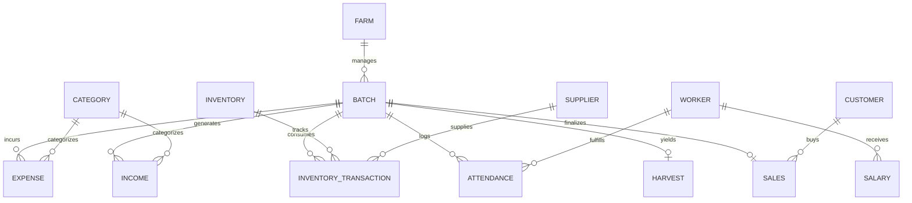
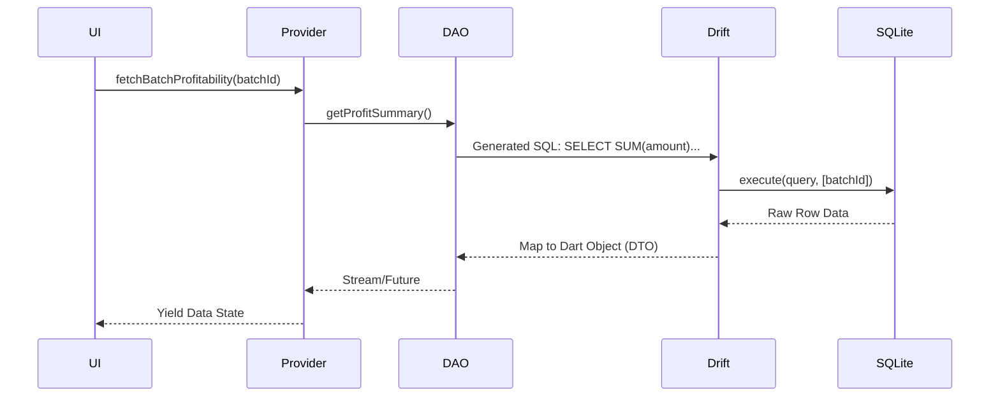
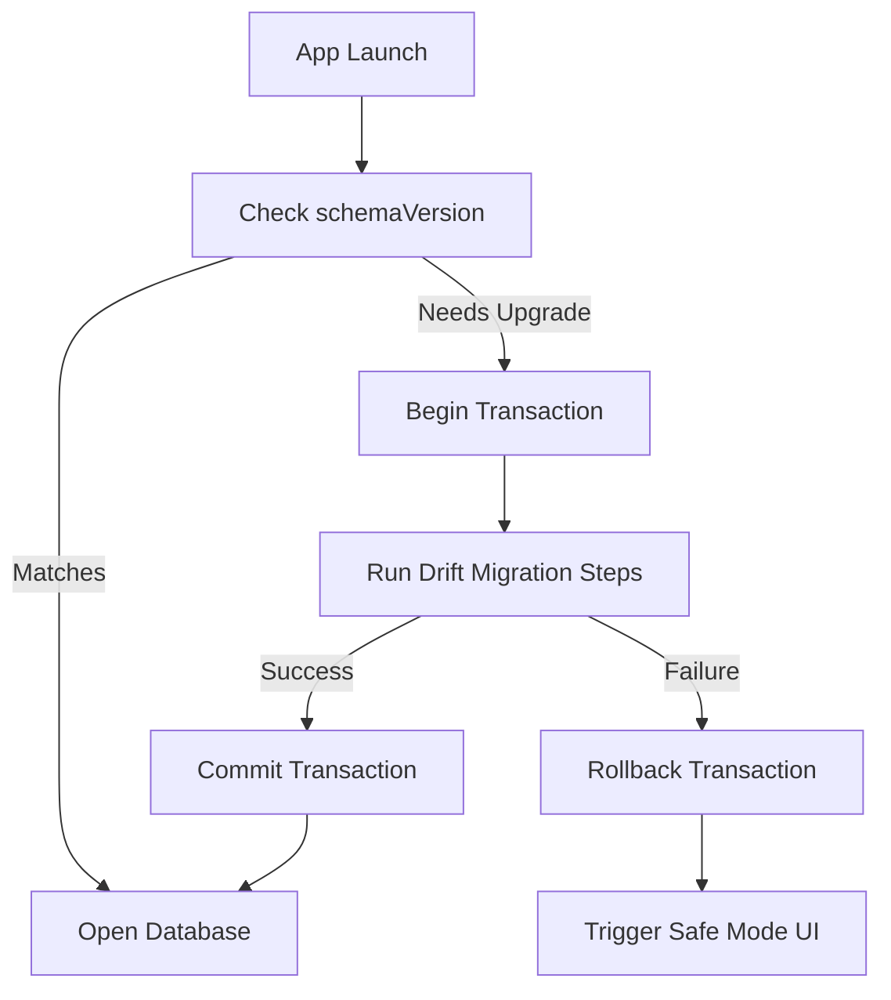

# Database Architecture Specification (DBAS)

## Document Control

**Version:** 1.0.0
**Status:** Draft
**Owner:** Principal Database Architect
**Revision History:**

| Version | Date       | Author                 | Changes                     |
| ------- | ---------- | ---------------------- | --------------------------- |
| 1.0.0   | 2026-07-28 | Principal DB Architect | Initial Architecture Design |

**Related Documents:**

- [ARCHITECTURE.md](ARCHITECTURE.md)
- [SRS.md](SRS.md)

---

## Database Overview

**Why SQLite?**
SQLite is chosen as the underlying database engine because it is an ACID-compliant, self-contained, serverless database that runs natively on the edge device. It offers unparalleled read/write speeds for local mobile applications and eliminates network latency entirely.

**Why Drift?**
Drift is selected as the Object-Relational Mapper (ORM) for Dart/Flutter because it provides reactive streams (via SQLite triggers), compile-time verification of SQL queries, type-safe data access, and robust schema migration tooling. It allows developers to write complex SQL while remaining firmly in the Dart ecosystem.

**Offline First Philosophy**
In FarmOS, the local SQLite database is the absolute Single Source of Truth (SSOT). The architecture assumes zero internet connectivity. Data is never queued for later cloud processing; transactions are finalized and committed locally.

---

## Database Design Principles

- **Normalization:** Data is normalized (3NF) to reduce redundancy. For example, Expenses reference a `Category` table rather than hardcoding category strings.
- **ACID:** Strict enforcement of Atomicity, Consistency, Isolation, and Durability using SQLite transactions.
- **Referential Integrity:** Enforced strictly via SQLite `FOREIGN KEY` constraints. Deletions will cascade or restrict based on domain rules.
- **UUID Strategy:** Auto-incrementing integers (`AUTOINCREMENT`) are prohibited for primary keys. All entities utilize UUID v4 to ensure future-proof P2P synchronization without primary key collisions.
- **Indexes:** Strategic B-Tree indexes are applied on frequently filtered columns (`date`, `batch_id`) to ensure querying remains <50ms even at 100k+ records.
- **Transactions:** Any multi-table mutation (e.g., deducting inventory and logging an expense) is wrapped in a unified Drift transaction.
- **Schema Versioning:** Drift's `schemaVersion` is incremented sequentially. Migrations are explicitly defined and tested.
- **Soft Delete vs Hard Delete:** Soft deletes (`deleted_at` timestamp) are used for critical operational data (Batches, Expenses) to preserve historical analytics and audit trails. Hard deletes are reserved for transient data (ActivityLog).
- **Audit Fields:** All primary tables include `created_at` and `updated_at` timestamps (Epoch milliseconds).
- **Time Zone Strategy:** All temporal data is stored strictly in UTC (Epoch milliseconds). The application layer handles conversion to local device time for display.
- **Naming Conventions:**
  - Tables: `snake_case` plural (e.g., `inventory_transactions`).
  - Columns: `snake_case` (e.g., `expected_harvest_date`).

---

## Complete ER Diagram

---

## Complete Tables

### Farm

- **Purpose:** Central entity defining the business unit.
- **Columns:** `id` (PK, Text), `name` (Text), `currency` (Text), `size` (Real), `size_unit` (Text), `created_at` (Int), `updated_at` (Int).
- **Constraints:** `id` is UUID. `name` cannot be null.
- **Validation:** Currency must be 3-letter ISO code.

### Batch

- **Purpose:** Represents a sericulture lifecycle. The central operational pivot.
- **Columns:** `id` (PK, Text), `farm_id` (FK), `status` (Text), `start_date` (Int), `expected_harvest_date` (Int), `actual_harvest_date` (Int, Nullable), `initial_quantity` (Int), `breed` (Text).
- **Constraints:** `status` must be one of [CHAWKI, LATE_AGE, SPINNING, HARVESTED, CANCELLED].
- **Indexes:** `idx_batch_status`, `idx_batch_farm_id`.

### Expense

- **Purpose:** Tracks monetary outflows.
- **Columns:** `id` (PK), `batch_id` (FK, Nullable), `category_id` (FK), `amount` (Real), `date` (Int), `notes` (Text).
- **Constraints:** `amount` > 0.
- **Indexes:** `idx_expense_date`, `idx_expense_batch`.

### Income

- **Purpose:** Tracks monetary inflows.
- **Columns:** `id` (PK), `batch_id` (FK, Nullable), `category_id` (FK), `amount` (Real), `date` (Int), `notes` (Text).

### Inventory

- **Purpose:** Catalog of items available on the farm.
- **Columns:** `id` (PK), `name` (Text), `unit` (Text), `current_quantity` (Real), `reorder_level` (Real).
- **Constraints:** `current_quantity` >= 0 (enforced via CHECK).

### InventoryTransaction

- **Purpose:** Ledger for inventory inward/outward movement.
- **Columns:** `id` (PK), `inventory_id` (FK), `batch_id` (FK, Nullable), `type` (Text: IN/OUT), `quantity` (Real), `date` (Int), `related_expense_id` (FK, Nullable).
- **Relationships:** Belongs to Inventory; Optionally links to Batch and Expense.

### Worker

- **Purpose:** Workforce profile.
- **Columns:** `id` (PK), `name` (Text), `phone` (Text, Nullable), `daily_wage` (Real), `role` (Text), `is_active` (Bool).

### Attendance

- **Purpose:** Daily worker log.
- **Columns:** `id` (PK), `worker_id` (FK), `batch_id` (FK, Nullable), `date` (Int), `status` (Text: PRESENT, ABSENT, HALF).
- **Indexes:** Unique composite index on `(worker_id, date)`.

### Salary

- **Purpose:** Log of payments made to workers.
- **Columns:** `id` (PK), `worker_id` (FK), `amount` (Real), `date` (Int), `start_date` (Int), `end_date` (Int).

### Customer

- **Purpose:** Directory of cocoon buyers.
- **Columns:** `id` (PK), `name` (Text), `phone` (Text).

### Supplier

- **Purpose:** Directory of raw material providers.
- **Columns:** `id` (PK), `name` (Text), `phone` (Text).

### Sales

- **Purpose:** Final commercial transaction for a batch.
- **Columns:** `id` (PK), `batch_id` (FK), `customer_id` (FK), `date` (Int), `total_amount` (Real), `notes` (Text).

### Harvest

- **Purpose:** Physical yield metrics of a batch.
- **Columns:** `id` (PK), `batch_id` (FK, UNIQUE), `date` (Int), `total_weight` (Real), `defect_weight` (Real), `grade` (Text).

### Production

- **Purpose:** Daily environmental or growth observations.
- **Columns:** `id` (PK), `batch_id` (FK), `metric_type` (Text: TEMP, HUMIDITY, MORTALITY), `value` (Real), `date` (Int).

### Settings

- **Purpose:** Key-Value store for app configuration.
- **Columns:** `key` (PK, Text), `value` (Text), `type` (Text).

### BackupHistory

- **Purpose:** Log of local backup events.
- **Columns:** `id` (PK), `date` (Int), `file_name` (Text), `size_bytes` (Int), `status` (Text).

### ActivityLog

- **Purpose:** Tamper-evident operational audit trail.
- **Columns:** `id` (PK), `entity_type` (Text), `entity_id` (Text), `action` (Text), `timestamp` (Int).

### Notifications

- **Purpose:** Local alerting (e.g., "Batch X needs harvesting").
- **Columns:** `id` (PK), `title` (Text), `body` (Text), `date` (Int), `is_read` (Bool).

### Attachments

- **Purpose:** File metadata for images/receipts.
- **Columns:** `id` (PK), `entity_type` (Text), `entity_id` (Text), `file_path` (Text), `type` (Text).

### Category

- **Purpose:** Customizable financial categorization.
- **Columns:** `id` (PK), `name` (Text), `type` (Text: INCOME, EXPENSE), `is_default` (Bool).

### Tags

- **Purpose:** Flexible taxonomy for filtering.
- **Columns:** `id` (PK), `name` (Text).

---

## Relationships

- **One To One:** `BATCH` (1) to `HARVEST` (0..1). A batch yields exactly one finalized harvest record.
- **One To Many:** `BATCH` (1) to `EXPENSE` (N). A batch incurs multiple expenses over its lifecycle.
- **Many To Many:** (Conceptual) Implemented via junction tables if needed, though most relations here are strictly hierarchical (Farm -> Batch -> Operations).

---

## UUID Strategy

- **Why UUID v4:** Randomly generated UUIDs prevent primary key collisions across disconnected devices, ensuring that if P2P sync or cloud backup is introduced later, records will merge safely.
- **Generation:** Generated strictly in the Domain layer via the Dart `uuid` package prior to database insertion.
- **Collision Prevention:** UUID v4 offers 122 bits of randomness. The probability of collision is statistically zero.
- **Future Sync:** Entities can be compared via `updated_at` timestamps to perform Last-Write-Wins (LWW) conflict resolution.

---

## Index Strategy

To maintain <50ms query speeds on low-end hardware:

- **Date Indexes:** `CREATE INDEX idx_expense_date ON expenses (date);`
- **Batch Indexes:** `CREATE INDEX idx_expense_batch ON expenses (batch_id);`
- **Category Indexes:** `CREATE INDEX idx_expense_cat ON expenses (category_id);`
- **Worker Indexes:** `CREATE INDEX idx_att_worker_date ON attendance (worker_id, date);`
- **Reports:** Covering indexes created for complex joins (e.g., linking Batch -> Expenses -> Category).
- **Search:** FTS5 virtual tables will be utilized for global string searching across `notes` and `name` fields.

---

## Transactions

Strict Drift Transactions (`transaction()` block) are required for:

- **Expense + Inventory:** Purchasing fertilizer must CREATE an `Expense` AND CREATE an `InventoryTransaction` (INWARD) AND UPDATE `Inventory` `current_quantity`. If one fails, the entire block rolls back.
- **Harvest + Sales:** Logging a final cocoon sale updates the `Sales` ledger and transitions the `Batch` status to `CLOSED`.
- **Attendance + Salary:** Calculating pending wage balances involves scanning `Attendance` and `Salary`.
- **Restore:** Wiping the existing schema and importing a backup file must be an atomic operation to prevent a "bricked" database state.

---

## Query Optimization

- **Pagination:** `LIMIT` and `OFFSET` utilized exclusively for ledger list views.
- **Filtering:** Executed natively in SQLite `WHERE` clauses, never in Dart memory.
- **Aggregation:** `SUM()`, `AVG()` handled in SQL to minimize data transfer across the FFI bridge.
- **JOINs:** Handled efficiently via covering indexes to prevent full table scans.
- **FTS5 Search:** Full-Text Search extension activated in SQLite for lightning-fast autocomplete.
- **Views:** SQL `VIEW`s created for complex recurring queries like `batch_profitability_summary`.

---

## Data Integrity

- **Foreign Keys:** `PRAGMA foreign_keys = ON;` strictly enforced. Attempting to delete a `Batch` with linked `Expenses` will cascade or fail depending on domain rules (typically Soft Delete is preferred).
- **Check Constraints:**
  - `CHECK (amount > 0)` on financials.
  - `CHECK (current_quantity >= 0)` on inventory.
- **Validation:** Pre-validation occurs in Domain Use Cases; database constraints act as the absolute final safeguard.

---

## Backup Strategy

- **Encrypted Database (.db):** Users can export an AES-256 encrypted raw SQLite file directly to their local `Downloads` directory using SQLCipher.
- **JSON Export:** A secondary export mechanism generating a plaintext or zip-compressed JSON tree of all user data for ultimate data portability.
- **Restore:** Parses the file, drops current schema, recreates schema, and streams data inward atomically.

---

## Database Security

- **Encryption:** `drift_sqflite` bundled with SQLCipher to encrypt the database on disk natively.
- **Key Management:** A random 256-bit encryption key is generated on first launch and stored in the Android hardware Keystore via `flutter_secure_storage`.
- **Backup Password:** Encrypted exports require the user to provide a manual PIN/Password which derives a secondary encryption key (PBKDF2) to protect the exported file.

---

## Storage Estimation

Estimations based on binary SQLite footprint, assuming UTF-8 strings.

| Volume          | Approximate DB Size |
| --------------- | ------------------- |
| 100 Records     | ~150 KB             |
| 1,000 Records   | ~1.5 MB             |
| 10,000 Records  | ~12 MB              |
| 100,000 Records | ~90 MB              |

_Conclusion:_ Even after years of heavy usage (100,000+ records), the database will comfortably occupy less than 100MB, posing no risk to low-end devices.

---

## Migration Plan

- **Version 1:** Initial MVP schema deployment.
- **Version 2/3:** Handled programmatically via Drift's `onUpgrade` step. E.g., `if (from < 2) { await m.addColumn(batches, batches.actualHarvestDate); }`
- **Breaking Changes:** Destructive changes (column renames/drops) require creating a temporary table, migrating data via `INSERT INTO ... SELECT`, dropping the old table, and renaming the temporary table.
- **Rollback Strategy:** If a migration throws an exception, SQLite rolls back the schema transaction. The app will refuse to launch into a corrupted state, prompting a safe-mode recovery.

---

## Performance Targets

Benchmarked against standard ARM Cortex-A53 (Low-end Android):

- **Query (Indexed Read):** < 50ms
- **Insert (Single Entity):** < 20ms
- **Update (Single Entity):** < 20ms
- **Delete (Single Entity):** < 20ms
- **Complex Aggregation (10k rows):** < 150ms

---

## Additional Mermaid Diagrams

### Query Flow Architecture

### Migration Flow

